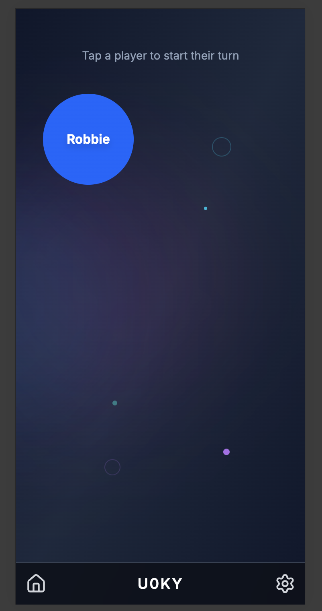
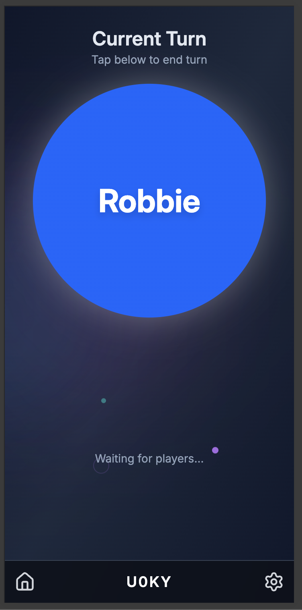

## Plan

1. Provide a very broad, high level project overview.
2. Receive something top of mind from each person.
    * This capitalizes on time prioritization and makes sure I can engage with everyone.
    * If I can't answer the question during the meeting, I'll follow up with Nic via email.
3. Move into reviewing things *I* found important or got wrapped up into.

## Purpose

Each user is intended to open their device while playing a board game.  When their turn is complete, they then select the next player in turn order.  This displays the active players turn on each device allowing everyone to know who's currently on deck.  This is particularly useful when board games have dynamic turns.

#### Prototype
I did an early HTML/CSS prototype of this.  I found the process of pulling out and syncing devices to just not be worth the squeeze.  I did fall in love with the idea of implementing it so decided to give it a go.

#### WebRTC
Originally this was true peer-to-peer using WebRTC.  However, handling source of truth, dropped connections, syncing, etc made it much easier to keep a server.

#### Commit History
Normally I try to include a synopsis and story reference. ```[ABC-2343] Synopsis``` format.  I didn't here since it was a "for fun" solo project.

## Architecture Overview

1. Initial user navigates to the site URL (React - Progressive Web App) and creates a room.  This connects via Websockets to the Go backend creating a room and returning a room code.


2. The initial user then shares that code with their friends verbally.  Allowing them to navigate to the PWA on their device and join the room.


3. Finally, actions taken on any single phone are then broadcast to others using websockets.  This should maintain a synced visual state amongst each phone.

[`backend/types/types.go:9`](../backend/types/types.go#9) Typing

#### Example
```json
{
  "type":"room_joined"
  "data": {}
}
```


User below is joining an existing room.  You can see it's populated by 2 other users already.  Any user can select a user to start that users turn.  Selecting a different user then switches to their turn, ending the previous persons turn.


## AI Usage

I use cursor which has built in AI and I use it thoroughly in "Ask" mode.  It helps with documentation generation, identifying bugs, providing suggestions, generating unit test, etc.

# Highlight Sections

### Routing
[`Game Container`](../frontend/src/components/GameContainer.tsx) 




* Shares state between [`sub routes`](../frontend/src/routes.tsx#10) passing down through [`context`](../frontend/src/components/GameContainer.tsx#275).
* Explicitly define where [`subscriptions`](../frontend/src/components/GameContainer.tsx#203) are handled from websockets.
* Handle [`game creation`](../frontend/src/components/GameContainer.tsx#24) before components loads. 
  * `https://.../turn-tracker/game/` should create a game and route to `https://.../turn-tracker/game/ABC` without creating the components needlessly.

[`start ws connection`](../backend/main.go#50)

[`turn sequence`](../backend/core/room.go#147)

[`disconnected clients`](../backend/core/hub.go#19)

# Random things I noticed which should be fixed
[`backend/core/client.go:113`](../backend/core/client.go#113) Should context cancellable, this was a quick fix to a deadlock panic.  It catches any panic though so not ideal.
