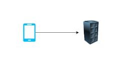
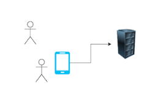
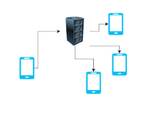

## Plan

1. Provide a very broad, high level project overview.
2. Recieve something top of mind from each person.
    * This capitalizes on time prioritization and makes sure I can engage with everyone.
    * If I can't answer the question during the meeting, I'll follow up with Nic via email.
3. Move into reviewing things *I* found important or got wrapped up into.

## Purpose

Each user is intended to pull out their device while playing a board game.  When their turn is complete, they then select the next player in turn order.  This displays the active players turn on each device allowing everyone to know who's currently on deck.  This is particularly useful when board games have dynamic turns.

#### Prototype
I did an early HTML/CSS prototype of this.  I found the process of pulling out and syncing devices to just not be worth the squeeze and was thoroughly unimpressed.  I did fall in love with the technical implementation so decided to do it anyhow.

## Context

This was built mainly as a fun technical project to do things I don't normally get to work with.  That is to say, it's over-engineered for the scale & purpose, read/writer and memory pooling really isn't needed.

#### Commit History
This is also why the commit history is just a mess.  Normally I try to include a synopsis and story reference. ```[ABC-2343] Synopsis``` format

#### WebRTC
I was even tempted to make this a serverless implementation (and may still).  Using WebRTC to create a true peer-to-peer mesh network.  Which introduces a TON of problems like source of truth, dropped connections, managing timing, etc.  So passed for now!

## Architecture Overview

1. Initial user navigates to the PWA (Progressive web app) and creates a room.  This creates a record in-memory of the Go app.  Returning a room code.



2. The initial user then shares that code with their friends verbally.  Allowing them to navigate to the PWA and join the room.



3. Finally, actions taken on any single phone are then broadcast to others using websocket.  This should maintain a synced visual state amongst each phone.

[`backend/types/types.go:9`](../backend/types/types.go#9) Typing

#### Example
```json
{
  "type":"room_joined"
  "data": {}
}
```



User below is joining an existing room.  You can see it's populated by 2 other users already.  Any user can select a user to start that users turn.  Selecting a different user then switches to their turn, ending the previous persons turn.


## AI Usage

I use cursor which has built in AI and I use it thoroughly in "Ask" mode.  It helps with documentation generation, identifying bugs, providing suggestions, generating unit test, etc.

# Highlight Sections

[`frontend/src/components/GameContainer.tsx`](../frontend/src/components/GameContainer.tsx) Game Container

* Share state between [`frontend/src/routes.tsx`](../frontend/src/routes.tsx#10) sub routes.
* Minimize / centralize where events were subscribed.
* Handle game creation before router resolution. `/turn-tracker/game/` should NOT load the component, redirect, and reload again.
* Postman collection

<!-- Hub -->
<!-- Handlers -->
<!-- turnSequence -->

# Random things I noticed which should be fixed
[`backend/core/client.go:113`](backend/core/client.go#113) Should context cancellable, this was a quick fix to a deadlock panic.  It catches any panic though so not ideal.
